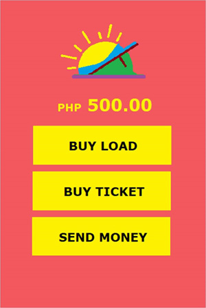
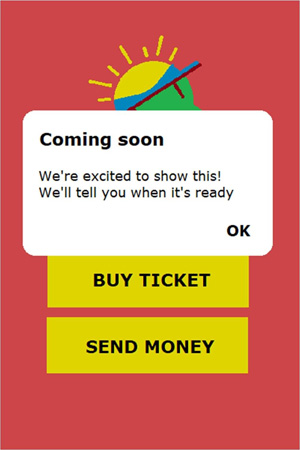
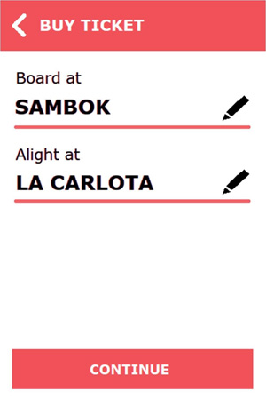
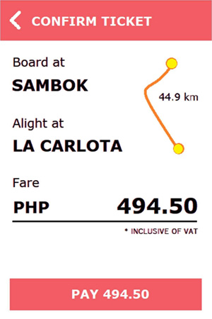
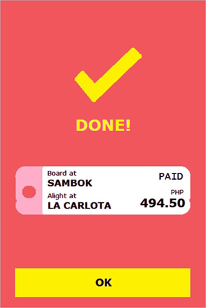

# Circlemove take home coding challenge

  
Table of Contents

  <ol>
    <li>
      <a href="#task">Task</a>
    </li>
    <li>
      <a href="#storyboard">Storyboard</a>
      <ul>
        <li><a href="#menu">Menu</a></li>
        <li><a href="#buy-ticket">Buy Ticket</a></li>
        <li><a href="#confirm-ticket">Confirm Ticket</a></li>
        <li><a href="#done">Done</a></li>
      </ul>
    </li>
  </ol>

## Task
You will build a mobile app that lets users buy tickets for bus rides.

Requirements:
- App has only one working feature: Buy Ticket
For all other features, app just says: Coming soon
- App must follow the navigation flow in storyboard.
- You can choose your own colors, fonts and layouts.
However, all information must be covered on each page.
- App can just store mock data in memory.
Databases, files, RESTful APIs are not required.

Preferred, but not required:
- Project can be opened in Android Studio.
- Code is written in pure Kotlin
- Adopts app architecture recommended by Google.

The base project can be opened in Android Studio, is 100% Kotlin and
adopts the app architecture recommended by Google. You can build your
app directly on top of this project to streamline your work.

Figures in storyboard are not taken from the base project. 

## Storyboard
App launch & splash

When user launches app, app shows a full-screen splash page.

After 3 seconds, app navigates to menu page automatically.

## Menu
In this full-screen page, user sees his/her wallet balance.

Besides, he/she sees three (3) options.
- Buy Load
- Buy Ticket
- Send Money

Among these options, only Buy Ticket is working.

When user clicks Buy Load or Send Money, app just says:

When user clicks Buy Ticket, app navigates to Buy Ticket page.

### View model & data layer
You are required to show the wallet balance on the page.
For this task, just store the mock value in memory.

## Buy Ticket
When buying a ticket, user must specify which bus stop to board at and
which bus stop to alight at before proceeding with the purchase.

When user clicks Continue, app navigates to Confirm Ticket page.
When user clicks navigation icon (Back), app navigates to menu page.

### UI layer
We recommend to use a Material Text Field with clickable trailing icon for
each selection. When trailing icon (Edit) is clicked, show a Material Alert
Dialog with all bus stops listed as single choice items.

You can assume that users can board and alight at any bus stop.

### View model layer
The information required to appear on this page are:
- which bus stop to board at, and
- which bus stop to alight at.

Changes in these selections must propagate to the UI immediately.

### Data layer
You need to create a mock list of bus stops.
Use the first bus stop as the initial bus stop to board at.
Use the last bus stop as the initial bus stop to alight at.

## Confirm Ticket
In this page, user sees the bus stop to board at and bus stop to alight at
together with the fare to pay for the ticket.

When user clicks Pay, app navigates to Done page.

### UI layer
You are not required to implement the map in Figure 5 that shows the
distance between the two bus stops in kilometers.

You are not required to show the fare twice on the page.

### View model layer
The information required to appear on this page are which bus stop to
board at and which bus stop to alight at.

Changes in these selections must propagate to the UI immediately.

### Data layer
You need to create a mock fare matrix. In a fare matrix, each ordered pair
of bus stops is mapped to the fare between them. You can choose any
suitable data structure to store them in memory.
 
## Done
This is the last page of the storyboard.
Same details are shown in the form of a ticket stub.
Feel free to use your creativity here.

User has no other choice but to click OK.
When user clicks OK, app navigates back to menu page.
